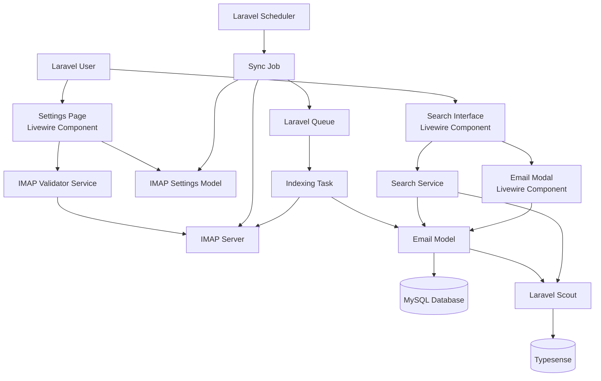

# Design Document: Mail Indexer and Searcher

## Overview

The mail indexer and searcher feature enables Laravel users to connect their IMAP email accounts, automatically index emails into a searchable database, and perform fast full-text searches across their email content. The system consists of three main subsystems:

1. **IMAP Settings Management**: A Livewire-based interface for configuring and validating IMAP connection settings
2. **Email Synchronization and Indexing**: Background jobs that connect to IMAP servers, retrieve emails, and index them into MySQL and Typesense
3. **Search and Display Interface**: A Livewire-based search interface with modal email viewing

The architecture leverages Laravel's queue system for asynchronous processing, Laravel Scout for Typesense integration, and Livewire for reactive UI components. Data is stored in MySQL for relational queries and Typesense for full-text search, with user-level data isolation enforced at all layers.

## Architecture

### System Components



### Technology Stack

- **Backend Framework**: Laravel 11.x
- **Frontend Framework**: Livewire 3.x with Flux UI components
- **Database**: MySQL 8.0+
- **Search Engine**: Typesense 26.0+
- **IMAP Client**: PHP IMAP extension or webklex/php-imap package
- **Queue System**: Laravel Queue (database driver or Redis)
- **Search Integration**: Laravel Scout with typesense-php adapter

### Data Flow

1. **Settings Configuration Flow**:
   - User enters IMAP settings → Livewire validates input → IMAP Validator tests connection → Settings encrypted and stored in MySQL

2. **Synchronization Flow**:
   - Scheduler triggers Sync Job → Sync Job queries users with IMAP settings → For each user, connect to IMAP → Identify new emails → Queue Indexing Tasks

3. **Indexing Flow**:
   - Indexing Task retrieves email from IMAP → Extract metadata and content → Store in MySQL → Scout automatically indexes to Typesense

4. **Search Flow**:
   - User enters query → Livewire sends to Search Service → Scout queries Typesense with user filter → Results returned and displayed → User clicks email → Modal fetches from MySQL and displays

## Components and Interfaces

### Models

#### ImapSetting Model

```php
namespace App\Models;

use Illuminate\Database\Eloquent\Model;
use Illuminate\Database\Eloquent\Relations\BelongsTo;

class ImapSetting extends Model
{
    protected $fillable = [
        'user_id',
        'hostname',
        'port',
        'username',
        'password',
        'encryption', // 'ssl', 'tls', or null
        'is_active',
    ];

    protected $casts = [
        'is_active' => 'boolean',
        'port' => 'integer',
    ];

    protected $hidden = ['password'];

    public function user(): BelongsTo
    {
        return $this->belongsTo(User::class);
    }

    // Accessor for decrypted password
    public function getDecryptedPasswordAttribute(): string
    {
        return decrypt($this->password);
    }

    // Mutator to encrypt password on save
    public function setPasswordAttribute($value): void
    {
        $this->attributes['password'] = encrypt($value);
    }
}
```

#### Email Model

```php
namespace App\Models;

use Illuminate\Database\Eloquent\Model;
use Illuminate\Database\Eloquent\Relations\BelongsTo;
use Laravel\Scout\Searchable;

class Email extends Model
{
    use Searchable;

    protected $fillable = [
        'user_id',
        'message_id',
        'folder',
        'from_address',
        'from_name',
        'to_addresses',
        'cc_addresses',
        'subject',
        'date',
        'body_text',
        'body_html',
        'attachments',
        'indexing_failed_at',
        'indexing_error',
    ];

    protected $casts = [
        'date' => 'datetime',
        'to_addresses' => 'array',
        'cc_addresses' => 'array',
        'attachments' => 'array', // [{filename, filetype}, ...]
        'indexing_failed_at' => 'datetime',
    ];

    public function user(): BelongsTo
    {
        return $this->belongsTo(User::class);
    }

    // Scout searchable configuration
    public function toSearchableArray(): array
    {
        return [
            'id' => $this->id,
            'user_id' => $this->user_id,
            'from_address' => $this->from_address,
            'from_name' => $this->from_name,
            'subject' => $this->subject,
            'body_text' => $this->body_text,
            'folder' => $this->folder,
            'date' => $this->date->timestamp,
        ];
    }

    public function searchableAs(): string
    {
        return 'emails';
    }
}
```

### Services

#### ImapConnectionService

Handles IMAP server connections and operations.

```php
namespace App\Services;

interface ImapConnectionService
{
    /**
     * Test IMAP connection with provided settings
     * 
     * @throws ImapConnectionException if connection fails
     */
    public function testConnection(
        string $hostname,
        int $port,
        string $username,
        string $password,
        ?string $encryption
    ): bool;

    /**
     * Connect to IMAP server using ImapSetting model
     * 
     * @throws ImapConnectionException if connection fails
     */
    public function connect(ImapSetting $settings): ImapConnection;

    /**
     * Retrieve list of all folders from IMAP server
     * 
     * @return array<string> Folder names
     */
    public function getFolders(ImapConnection $connection): array;

    /**
     * Get list of message IDs in a folder
     * 
     * @return array<string> Message IDs
     */
    public function getMessageIds(ImapConnection $connection, string $folder): array;

    /**
     * Retrieve full email content by message ID
     */
    public function getEmail(ImapConnection $connection, string $messageId): EmailData;
}
```

#### EmailIndexingService

Handles email extraction and indexing logic.

```php
namespace App\Services;

interface EmailIndexingService
{
    /**
     * Index a single email for a user
     * 
     * @return Email The created Email model
     * @throws IndexingException if indexing fails
     */
    public function indexEmail(
        User $user,
        string $messageId,
        string $folder,
        ImapConnection $connection
    ): Email;

    /**
     * Check if an email has already been indexed
     */
    public function isEmailIndexed(User $user, string $messageId): bool;

    /**
     * Extract email metadata and content from IMAP message
     */
    public function extractEmailData(ImapConnection $connection, string $messageId): EmailData;
}
```

#### EmailSearchService

Handles search query execution and result formatting.

```php
namespace App\Services;

interface EmailSearchService
{
    /**
     * Search emails for a user
     * 
     * @return \Illuminate\Pagination\LengthAwarePaginator
     */
    public function search(User $user, string $query, ?string $folder = null, int $perPage = 20);

    /**
     * Get recent emails for a user (when no search query)
     * 
     * @return \Illuminate\Pagination\LengthAwarePaginator
     */
    public function getRecent(User $user, int $perPage = 20);

    /**
     * Format search result for display
     */
    public function formatResult(Email $email, ?string $query = null): array;
}
```

### Livewire Components

#### ImapSettingsComponent

Manages IMAP settings configuration.

```php
namespace App\Livewire;

use Livewire\Component;

class ImapSettingsComponent extends Component
{
    public string $hostname = '';
    public int $port = 993;
    public string $username = '';
    public string $password = '';
    public string $encryption = 'ssl';
    public bool $isActive = true;

    public string $testMessage = '';
    public string $testStatus = ''; // 'success', 'error', ''

    protected $rules = [
        'hostname' => 'required|string|max:255',
        'port' => 'required|integer|min:1|max:65535',
        'username' => 'required|string|max:255',
        'password' => 'required|string',
        'encryption' => 'nullable|in:ssl,tls',
    ];

    public function mount(): void;
    public function testConnection(): void;
    public function save(): void;
    public function render(): View;
}
```

#### EmailSearchComponent

Provides search interface and results display.

```php
namespace App\Livewire;

use Livewire\Component;
use Livewire\WithPagination;

class EmailSearchComponent extends Component
{
    use WithPagination;

    public string $query = '';
    public ?string $folderFilter = null;
    public ?int $selectedEmailId = null;

    protected $queryString = ['query', 'folderFilter'];

    public function updatedQuery(): void;
    public function selectEmail(int $emailId): void;
    public function closeModal(): void;
    public function render(): View;
}
```

#### EmailModalComponent

Displays full email content in a modal.

```php
namespace App\Livewire;

use Livewire\Component;

class EmailModalComponent extends Component
{
    public ?Email $email = null;
    public bool $show = false;

    public function open(int $emailId): void;
    public function close(): void;
    public function openInNewTab(): void;
    public function render(): View;
}
```

### Jobs

#### SyncEmailsJob

Scheduled job that identifies new emails and queues indexing tasks.

```php
namespace App\Jobs;

use Illuminate\Bus\Queueable;
use Illuminate\Contracts\Queue\ShouldQueue;
use Illuminate\Foundation\Bus\Dispatchable;
use Illuminate\Queue\InteractsWithQueue;
use Illuminate\Queue\SerializesModels;

class SyncEmailsJob implements ShouldQueue
{
    use Dispatchable, InteractsWithQueue, Queueable, SerializesModels;

    public function handle(
        ImapConnectionService $imapService,
        EmailIndexingService $indexingService
    ): void;
}
```

#### IndexEmailJob

Queued job that indexes a single email.

```php
namespace App\Jobs;

use Illuminate\Bus\Queueable;
use Illuminate\Contracts\Queue\ShouldQueue;
use Illuminate\Foundation\Bus\Dispatchable;
use Illuminate\Queue\InteractsWithQueue;
use Illuminate\Queue\SerializesModels;

class IndexEmailJob implements ShouldQueue
{
    use Dispatchable, InteractsWithQueue, Queueable, SerializesModels;

    public int $tries = 3;
    public int $backoff = 60; // seconds

    public function __construct(
        public int $userId,
        public string $messageId,
        public string $folder
    ) {}

    public function handle(
        ImapConnectionService $imapService,
        EmailIndexingService $indexingService
    ): void;
}
```

### Data Transfer Objects

#### EmailData

```php
namespace App\DataTransferObjects;

class EmailData
{
    public function __construct(
        public string $messageId,
        public string $fromAddress,
        public ?string $fromName,
        public array $toAddresses,
        public array $ccAddresses,
        public string $subject,
        public \DateTime $date,
        public ?string $bodyText,
        public ?string $bodyHtml,
        public array $attachments, // [{filename: string, filetype: string}, ...]
    ) {}
}
```

#### ImapConnection

```php
namespace App\DataTransferObjects;

class ImapConnection
{
    public function __construct(
        public mixed $resource, // IMAP connection resource
        public ImapSetting $settings
    ) {}

    public function disconnect(): void;
}
```

## Data Models

### Database Schema

#### imap_settings Table

```sql
CREATE TABLE imap_settings (
    id BIGINT UNSIGNED AUTO_INCREMENT PRIMARY KEY,
    user_id BIGINT UNSIGNED NOT NULL,
    hostname VARCHAR(255) NOT NULL,
    port INT UNSIGNED NOT NULL,
    username VARCHAR(255) NOT NULL,
    password TEXT NOT NULL, -- Encrypted
    encryption VARCHAR(10) NULL, -- 'ssl', 'tls', or NULL
    is_active BOOLEAN DEFAULT TRUE,
    created_at TIMESTAMP NULL,
    updated_at TIMESTAMP NULL,
    
    FOREIGN KEY (user_id) REFERENCES users(id) ON DELETE CASCADE,
    INDEX idx_user_active (user_id, is_active)
);
```

#### emails Table

```sql
CREATE TABLE emails (
    id BIGINT UNSIGNED AUTO_INCREMENT PRIMARY KEY,
    user_id BIGINT UNSIGNED NOT NULL,
    message_id VARCHAR(255) NOT NULL,
    folder VARCHAR(255) NOT NULL,
    from_address VARCHAR(255) NOT NULL,
    from_name VARCHAR(255) NULL,
    to_addresses JSON NOT NULL,
    cc_addresses JSON NULL,
    subject TEXT NULL,
    date DATETIME NOT NULL,
    body_text LONGTEXT NULL,
    body_html LONGTEXT NULL,
    attachments JSON NULL, -- [{filename, filetype}, ...]
    indexing_failed_at TIMESTAMP NULL,
    indexing_error TEXT NULL,
    created_at TIMESTAMP NULL,
    updated_at TIMESTAMP NULL,
    
    FOREIGN KEY (user_id) REFERENCES users(id) ON DELETE CASCADE,
    UNIQUE KEY unique_user_message (user_id, message_id),
    INDEX idx_user_date (user_id, date),
    INDEX idx_user_folder (user_id, folder),
    INDEX idx_message_id (message_id)
);
```

### Typesense Schema

```json
{
  "name": "emails",
  "fields": [
    {"name": "id", "type": "int64"},
    {"name": "user_id", "type": "int64", "facet": true},
    {"name": "from_address", "type": "string"},
    {"name": "from_name", "type": "string", "optional": true},
    {"name": "subject", "type": "string"},
    {"name": "body_text", "type": "string"},
    {"name": "folder", "type": "string", "facet": true},
    {"name": "date", "type": "int64"}
  ],
  "default_sorting_field": "date"
}
```

### Data Relationships

- **User → ImapSetting**: One-to-one (a user has one IMAP configuration)
- **User → Email**: One-to-many (a user has many indexed emails)
- **Email → Typesense Document**: One-to-one (each email has one search index entry)

### Data Isolation Strategy

All queries must filter by `user_id` to ensure data isolation:
- MySQL queries: `WHERE user_id = ?`
- Typesense queries: `filter_by: "user_id:={userId}"`
- Scout automatically applies user filter through model scopes


## Correctness Properties

*A property is a characteristic or behavior that should hold true across all valid executions of a system—essentially, a formal statement about what the system should do. Properties serve as the bridge between human-readable specifications and machine-verifiable correctness guarantees.*

### Property 1: Password Encryption Round-Trip

*For any* password string, encrypting it using Laravel's encryption and then decrypting it SHALL return the original password value unchanged.

**Validates: Requirements 1.6, 6.1**

### Property 2: Unindexed Email Identification

*For any* set of IMAP message IDs and any set of already-indexed email message IDs for a user, the identified unindexed emails SHALL be exactly the set difference (IMAP messages - indexed messages).

**Validates: Requirements 2.5**

### Property 3: Email Data Extraction Completeness

*For any* valid email message structure, the extraction process SHALL produce an EmailData object containing all required fields: message ID, from address, to addresses, subject, date, body content (text and/or HTML when present), and attachment metadata (filename and filetype) for all attachments, with no attachment file content included.

**Validates: Requirements 3.2, 3.3, 3.4, 3.5, 6.5**

### Property 4: Indexing Idempotence

*For any* email message, indexing it multiple times SHALL result in exactly one Email_Record in the database with the same content as indexing it once.

**Validates: Requirements 3.9**

### Property 5: Search Result Data Isolation

*For any* search query and any authenticated user, all returned Email_Record results SHALL have a user_id matching the authenticated user's ID, and any attempt to access an Email_Record with a non-matching user_id SHALL be denied.

**Validates: Requirements 4.3, 6.2, 6.4**

### Property 6: Search Result Formatting

*For any* Email_Record, the formatted search result string SHALL contain the from address, subject, and a content preview or highlight.

**Validates: Requirements 4.5**

### Property 7: Search Term Highlighting

*For any* search query term and any result text containing that term, the highlighted output SHALL wrap all occurrences of the term with highlight markers while preserving the original text content.

**Validates: Requirements 4.6**

### Property 8: HTML Sanitization Safety

*For any* HTML email content including potentially malicious scripts or dangerous tags, the sanitized output SHALL remove all XSS attack vectors (script tags, event handlers, javascript: URLs) while preserving safe HTML structure and content.

**Validates: Requirements 5.3, 6.6**

### Property 9: Input Validation Completeness

*For any* IMAP settings input with invalid values (empty hostname, out-of-range port, empty username, empty password), the validation SHALL fail and prevent connection attempts before any IMAP server interaction.

**Validates: Requirements 8.6**

### Property 10: Folder Filtering Accuracy

*For any* folder name filter and any set of Email_Records, the filtered results SHALL contain only emails where the folder field exactly matches the filter value.

**Validates: Requirements 9.3**

## Error Handling

### IMAP Connection Errors

**Strategy**: Graceful degradation with user feedback

- **Connection Timeout**: Display "Unable to connect to mail server. Please check hostname and port." with 10-second timeout
- **Authentication Failure**: Display "Invalid username or password. Please check your credentials."
- **SSL/TLS Errors**: Display "Secure connection failed. Please verify SSL/TLS settings."
- **Network Errors**: Log error, continue processing other users in sync job

**Implementation**:
```php
try {
    $connection = $imapService->connect($settings);
} catch (ImapConnectionException $e) {
    Log::error('IMAP connection failed', [
        'user_id' => $user->id,
        'error' => $e->getMessage()
    ]);
    
    if ($e instanceof AuthenticationException) {
        return back()->withErrors(['password' => 'Invalid credentials']);
    }
    
    return back()->withErrors(['hostname' => 'Connection failed: ' . $e->getMessage()]);
}
```

### Indexing Errors

**Strategy**: Retry with exponential backoff, then mark as failed

- **Transient Errors**: Retry up to 3 times with 60s, 120s, 240s backoff
- **Permanent Errors**: Mark email with `indexing_failed_at` and `indexing_error` fields
- **Database Errors**: Roll back transaction, do not index to Typesense
- **Typesense Errors**: Log error, mark for re-indexing

**Implementation**:
```php
class IndexEmailJob implements ShouldQueue
{
    public int $tries = 3;
    public array $backoff = [60, 120, 240];

    public function failed(Throwable $exception): void
    {
        Email::where('user_id', $this->userId)
            ->where('message_id', $this->messageId)
            ->update([
                'indexing_failed_at' => now(),
                'indexing_error' => $exception->getMessage()
            ]);
    }
}
```

### Search Errors

**Strategy**: User-friendly error messages with fallback

- **Typesense Unavailable**: Display "Search is temporarily unavailable. Please try again later." and fall back to MySQL LIKE queries
- **Query Syntax Errors**: Sanitize query and retry, or display "Invalid search query"
- **Timeout Errors**: Display "Search took too long. Please try a more specific query."

**Implementation**:
```php
try {
    $results = Email::search($query)
        ->where('user_id', $user->id)
        ->paginate(20);
} catch (TypesenseException $e) {
    Log::error('Typesense search failed', ['error' => $e->getMessage()]);
    
    // Fallback to MySQL
    $results = Email::where('user_id', $user->id)
        ->where(function($q) use ($query) {
            $q->where('subject', 'LIKE', "%{$query}%")
              ->orWhere('body_text', 'LIKE', "%{$query}%");
        })
        ->paginate(20);
    
    session()->flash('warning', 'Search is temporarily unavailable. Showing basic results.');
}
```

### Data Consistency Errors

**Strategy**: Transactional integrity with rollback

- **MySQL + Typesense Sync**: Use database transactions, only index to Typesense after MySQL commit
- **Partial Indexing Failures**: Mark emails for re-indexing, provide admin command to retry failed emails
- **Orphaned Records**: Provide artisan command to clean up inconsistencies

**Implementation**:
```php
DB::transaction(function () use ($emailData, $user) {
    $email = Email::create([
        'user_id' => $user->id,
        'message_id' => $emailData->messageId,
        // ... other fields
    ]);
    
    // Scout will automatically index after transaction commits
    // If transaction rolls back, indexing won't happen
});
```

## Testing Strategy

### Unit Testing Approach

Unit tests will focus on specific examples, edge cases, and error conditions for individual components:

**Service Layer Tests**:
- `ImapConnectionService`: Test connection with valid/invalid credentials, SSL/TLS modes
- `EmailIndexingService`: Test email data extraction with various email formats
- `EmailSearchService`: Test result formatting, query sanitization

**Model Tests**:
- `ImapSetting`: Test password encryption/decryption, validation rules
- `Email`: Test searchable array generation, relationships

**Job Tests**:
- `SyncEmailsJob`: Test user iteration, error handling, job queuing
- `IndexEmailJob`: Test retry logic, failure handling

**Livewire Component Tests**:
- `ImapSettingsComponent`: Test form validation, connection testing, save functionality
- `EmailSearchComponent`: Test search query updates, pagination, modal opening
- `EmailModalComponent`: Test email display, HTML sanitization, authorization

### Property-Based Testing Approach

Property-based tests will verify universal properties across many generated inputs using **Pest PHP with Pest Plugin for Property Testing** (or **PHPUnit with Eris**).

**Configuration**: Each property test will run a minimum of 100 iterations with randomly generated inputs.

**Test Tagging**: Each property test will include a comment tag referencing the design property:
```php
// Feature: mail-indexer-searcher, Property 1: Password Encryption Round-Trip
```

**Property Test Implementation**:

1. **Password Encryption Round-Trip** (Property 1):
   - Generate random password strings (various lengths, special characters, unicode)
   - Encrypt using Laravel encryption
   - Decrypt and verify equality with original
   - Tag: `Feature: mail-indexer-searcher, Property 1: Password Encryption Round-Trip`

2. **Unindexed Email Identification** (Property 2):
   - Generate random sets of IMAP message IDs
   - Generate random sets of indexed message IDs
   - Verify identified unindexed emails = set difference
   - Tag: `Feature: mail-indexer-searcher, Property 2: Unindexed Email Identification`

3. **Email Data Extraction Completeness** (Property 3):
   - Generate random email structures with varying fields
   - Extract data using `EmailIndexingService`
   - Verify all required fields are present and attachment content is excluded
   - Tag: `Feature: mail-indexer-searcher, Property 3: Email Data Extraction Completeness`

4. **Indexing Idempotence** (Property 4):
   - Generate random email data
   - Index N times (where N is random 1-10)
   - Verify only one record exists with correct content
   - Tag: `Feature: mail-indexer-searcher, Property 4: Indexing Idempotence`

5. **Search Result Data Isolation** (Property 5):
   - Generate random user IDs and email records
   - Execute searches with different authenticated users
   - Verify all results match authenticated user ID
   - Verify cross-user access attempts are denied
   - Tag: `Feature: mail-indexer-searcher, Property 5: Search Result Data Isolation`

6. **Search Result Formatting** (Property 6):
   - Generate random Email_Record instances
   - Format using `EmailSearchService`
   - Verify formatted string contains from, subject, and preview
   - Tag: `Feature: mail-indexer-searcher, Property 6: Search Result Formatting`

7. **Search Term Highlighting** (Property 7):
   - Generate random search terms and text content
   - Apply highlighting logic
   - Verify all term occurrences are wrapped and text is preserved
   - Tag: `Feature: mail-indexer-searcher, Property 7: Search Term Highlighting`

8. **HTML Sanitization Safety** (Property 8):
   - Generate random HTML including XSS payloads (script tags, event handlers, javascript: URLs)
   - Sanitize using email modal sanitization logic
   - Verify dangerous content is removed and safe HTML is preserved
   - Tag: `Feature: mail-indexer-searcher, Property 8: HTML Sanitization Safety`

9. **Input Validation Completeness** (Property 9):
   - Generate random invalid IMAP settings (empty fields, invalid ports)
   - Validate using settings form validation
   - Verify validation fails before connection attempts
   - Tag: `Feature: mail-indexer-searcher, Property 9: Input Validation Completeness`

10. **Folder Filtering Accuracy** (Property 10):
    - Generate random email records with various folder names
    - Apply folder filters
    - Verify filtered results contain only matching folder emails
    - Tag: `Feature: mail-indexer-searcher, Property 10: Folder Filtering Accuracy`

### Integration Testing Approach

Integration tests will verify external service interactions with 1-3 representative examples:

**IMAP Integration**:
- Test connection to mock IMAP server
- Test folder retrieval
- Test email retrieval
- Test authentication failure handling

**Typesense Integration**:
- Test indexing via Scout
- Test search query execution
- Test unavailability handling
- Test performance with large datasets (up to 100k emails)

**Database Integration**:
- Test email storage with transactions
- Test concurrent indexing
- Test data isolation queries

### End-to-End Testing Approach

E2E tests will verify complete user workflows:

1. **Settings Configuration Flow**: User enters IMAP settings → tests connection → saves settings
2. **Email Synchronization Flow**: Scheduler triggers sync → emails are indexed → searchable in UI
3. **Search Flow**: User enters query → results display → clicks email → modal opens → email displays
4. **Error Recovery Flow**: IMAP connection fails → error displayed → user corrects settings → retry succeeds

### Test Coverage Goals

- **Unit Tests**: 80%+ code coverage for services, models, jobs
- **Property Tests**: 100% coverage of all 10 correctness properties
- **Integration Tests**: All external service interactions covered
- **E2E Tests**: All critical user workflows covered

### Testing Tools

- **Unit/Integration**: Pest PHP or PHPUnit
- **Property-Based**: Pest Plugin for Property Testing or Eris
- **E2E**: Laravel Dusk
- **Mocking**: Mockery for IMAP/Typesense services
- **Database**: SQLite in-memory for fast test execution
