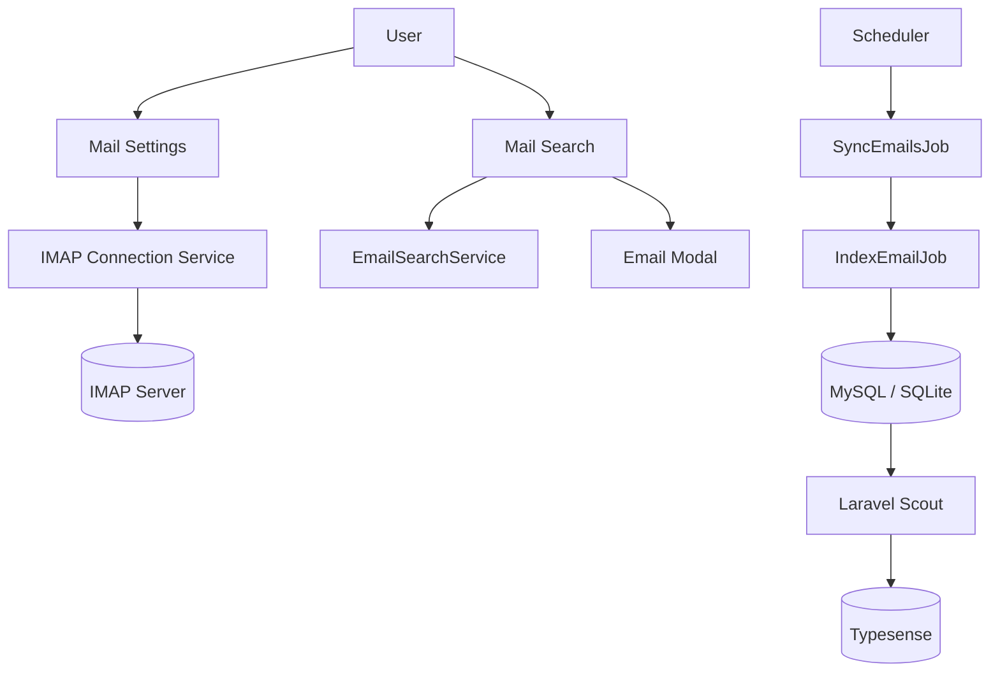

# Mail Indexer and Searcher

A Laravel + Livewire mail indexing system that lets each authenticated user connect an IMAP mailbox, sync messages in the background, index them into MySQL and Typesense, and search them through a responsive UI.

## Features

- Per-user IMAP settings with connection testing
- Encrypted IMAP passwords at rest
- Scheduled mailbox synchronization across folders
- Queued email indexing with retry and failure tracking
- MySQL storage for canonical email records
- Typesense full-text search via Laravel Scout
- Livewire search UI with debounced queries, folder filters, pagination, and email modal viewing
- HTML sanitization for safe email rendering
- Maintenance commands for retrying failed indexing and cleanup

## Tech Stack

- PHP 8.3+
- Laravel 13
- Livewire 4 + Flux UI
- Laravel Scout
- Typesense PHP client
- `webklex/php-imap`
- SQLite/MySQL compatible persistence
- Pest for testing

## Application Flow



## Main User Flows

1. User opens `settings/mail`
2. Enters IMAP credentials and tests the connection
3. Settings are saved with encrypted password storage
4. Scheduler queues sync work for active mailboxes
5. New messages are indexed into the database and search engine
6. User searches at `emails`, filters by folder, and opens messages inline or in a dedicated page

## Routes

- `GET /settings/mail` — IMAP settings page
- `GET /emails` — search interface
- `GET /emails/{emailId}` — standalone email detail view

## Data Model Summary

### `imap_settings`

Stores one mailbox configuration per user:

- hostname
- port
- username
- encrypted password
- encryption mode (`ssl`, `tls`, or `null`)
- active flag

### `emails`

Stores indexed mail metadata and content:

- message id
- folder
- sender / recipients
- subject
- sent date
- text and HTML bodies
- attachment metadata only
- indexing failure markers

## Search and Security

- Every search is scoped by `user_id`
- Email detail access is restricted to the owning user
- HTML bodies are sanitized before rendering
- Attachment file contents are never stored
- Search falls back to MySQL when Typesense is unavailable

## Setup

### 1. Install dependencies

```bash
composer install
npm install
```

### 2. Configure environment

```bash
cp .env.example .env
php artisan key:generate
php artisan migrate
```

Important mail/search settings in `.env`:

```env
QUEUE_CONNECTION=database
QUEUE_AFTER_COMMIT=true

SCOUT_DRIVER=typesense
SCOUT_QUEUE=true
SCOUT_AFTER_COMMIT=true
SCOUT_CHUNK_SEARCHABLE=500
SCOUT_CHUNK_UNSEARCHABLE=500

TYPESENSE_HOST=localhost
TYPESENSE_PORT=8108
TYPESENSE_PROTOCOL=http
TYPESENSE_API_KEY=xyz
```

### 3. Build frontend assets

```bash
npm run build
```

### 4. Initialize Typesense and import emails

```bash
php artisan mail:typesense:init --fresh
php artisan scout:import "App\Models\Email"
```

## Running the App

### Development

```bash
composer dev
```

This starts:

- Laravel server
- queue worker
- Vite dev server

### Queue worker only

```bash
composer queue:work
```

Equivalent command:

```bash
php artisan queue:work --tries=3 --backoff=60 --sleep=1
```

### Scheduled sync

The sync job is registered with Laravel's scheduler. In production, run the scheduler normally:

```bash
php artisan schedule:work
```

or configure cron for `php artisan schedule:run`.

## Indexing and Maintenance Commands

### Initialize search collection

```bash
php artisan mail:typesense:init
php artisan mail:typesense:init --fresh
```

### Retry failed indexed emails

```bash
php artisan mail:retry-failed
php artisan mail:retry-failed --dry-run
```

### Cleanup inconsistencies

```bash
php artisan mail:cleanup
php artisan mail:cleanup --dry-run
```

## Testing

Run the full validation suite:

```bash
composer lint:check
php artisan test
```

The project includes:

- model, service, job, and Livewire tests
- integration coverage for IMAP, database indexing, and Typesense-backed search behavior
- end-to-end workflow tests for settings, sync, search, and error recovery

## Implementation Notes

- Search input is debounced for faster UX and fewer requests
- Scout indexing is queued and configured for chunked batch processing
- Queue jobs run after database commit for consistency
- Failed indexing attempts are tracked for retry workflows

## Production Checklist

- Configure a real database
- Run a Typesense instance
- Set real IMAP credentials per user
- Run queue workers continuously
- Run the Laravel scheduler continuously
- Build frontend assets for production

## License

MIT
